# Trillavision Streaming App - Comprehensive Codebase Review Plan

## Overview

This document outlines our systematic approach to reviewing the Trillavision Streaming App codebase. The goal is to identify what each component needs, what's missing, and create a plan for developing clean, modular, production-ready code with proper separation of concerns.

## Review Methodology

We'll use a multi-phase approach to ensure thorough analysis:

```mermaid
flowchart TD
    A[Codebase Review] --> B[Project Structure Analysis]
    A --> C[Component Architecture Review]
    A --> D[State Management Analysis]
    A --> E[UI/UX Evaluation]
    A --> F[Performance Assessment]
    A --> G[Code Quality Review]
    
    B --> B1[Directory Structure]
    B --> B2[File Organization]
    B --> B3[Build Configuration]
    
    C --> C1[Component Hierarchy]
    C --> C2[Component Interfaces]
    C --> C3[Component Dependencies]
    C --> C4[Reusability Assessment]
    
    D --> D1[State Management Patterns]
    D --> D2[Data Flow]
    D --> D3[Side Effects Handling]
    
    E --> E1[UI Component Consistency]
    E --> E2[Responsive Design]
    E --> E3[Accessibility]
    
    F --> F1[Rendering Optimization]
    F --> F2[Asset Loading]
    F --> F3[Network Requests]
    
    G --> G1[Code Style Consistency]
    G --> G2[Documentation Quality]
    G --> G3[Test Coverage]
```

## Phase 1: Project Structure Analysis

### 1.1 Directory Structure Review
- Analyze the overall organization of directories
- Identify any missing directories needed for proper organization
- Evaluate separation of concerns at the directory level

### 1.2 File Organization Assessment
- Review naming conventions for consistency
- Check for proper grouping of related files
- Identify any misplaced files

### 1.3 Build Configuration Evaluation
- Review package.json for dependencies and scripts
- Analyze build tools configuration (Vite, TypeScript, etc.)
- Identify any missing or outdated dependencies

## Phase 2: Component Architecture Review

### 2.1 Core UI Components
- Review base UI components (Button, Card, Input, etc.)
- Identify missing UI components or functionality
- Evaluate component API design and consistency

### 2.2 Panel Components
- Analyze each panel component in detail
- Identify missing functionality in panels
- Evaluate panel layout and organization

### 2.3 Layout Components
- Review layout structure components
- Analyze responsiveness and adaptability
- Identify improvements for layout management

### 2.4 Feature Components
- Review streaming-specific components
- Analyze audio processing components
- Evaluate integration components (YouTube, etc.)

## Phase 3: State Management Analysis

### 3.1 Redux Store Structure
- Review store organization and slice structure
- Analyze action creators and reducers
- Identify missing state management needs

### 3.2 Component State Management
- Review local state usage in components
- Identify state that should be lifted or centralized
- Analyze prop drilling issues

### 3.3 Side Effects Handling
- Review async operations management
- Analyze API integration patterns
- Identify improvements for side effect handling

## Phase 4: UI/UX Evaluation

### 4.1 Panel Card Elements
- Detailed review of each panel's UI elements
- Analyze space utilization within panels
- Identify UI inconsistencies across panels

### 4.2 Navigation and User Flow
- Review application navigation structure
- Analyze user flows for common tasks
- Identify UX improvements

### 4.3 Visual Design Consistency
- Review color usage and theme implementation
- Analyze typography and spacing consistency
- Identify visual design improvements

## Phase 5: Performance Assessment

### 5.1 Rendering Optimization
- Review component rendering patterns
- Identify unnecessary re-renders
- Analyze memoization usage

### 5.2 Asset Loading
- Review image and asset loading strategies
- Identify optimization opportunities
- Analyze lazy loading implementation

### 5.3 Network Request Optimization
- Review API call patterns
- Analyze caching strategies
- Identify network optimization opportunities

## Phase 6: Code Quality Review

### 6.1 Code Style and Consistency
- Review coding standards adherence
- Analyze TypeScript usage and type safety
- Identify areas needing refactoring

### 6.2 Documentation Quality
- Review inline documentation and comments
- Analyze component documentation
- Identify documentation gaps

### 6.3 Error Handling
- Review error handling patterns
- Analyze edge case management
- Identify error handling improvements

## Deliverables

For each component category, we'll produce:

1. **Current State Assessment**: Detailed analysis of existing code
2. **Gap Analysis**: Identification of missing functionality or components
3. **Improvement Recommendations**: Prioritized list of enhancements
4. **Implementation Plan**: Detailed steps for implementing improvements

## Panel-Specific Deep Dives

We'll conduct detailed reviews of three critical panels:

1. **Stream Controls Panel**: Core functionality for controlling streams
2. **Scene Transitions Panel**: Essential for professional streaming experience
3. **Stream Settings Panel**: Critical for configuration and customization

Each panel review will include:

- Component structure analysis
- State management review
- UI/UX evaluation
- Performance assessment
- Code quality review
- Detailed implementation recommendations

## Timeline

| Phase | Task | Duration |
|-------|------|----------|
| 1 | Project Structure Analysis | 1 day |
| 2 | Component Architecture Review | 3 days |
| 3 | State Management Analysis | 2 days |
| 4 | UI/UX Evaluation | 2 days |
| 5 | Performance Assessment | 1 day |
| 6 | Code Quality Review | 1 day |
| 7 | Panel-Specific Deep Dives | 3 days |
| 8 | Final Report & GitHub Setup | 1 day |

Total estimated time: 14 days

## Next Steps

After completing this comprehensive review, we will:

1. Create a GitHub repository for the project
2. Set up proper CI/CD pipelines
3. Implement the highest priority improvements
4. Establish coding standards and documentation requirements
5. Begin systematic enhancement of the application

This methodical approach will ensure we maintain separation of concerns, professional code quality, and organized development practices throughout the project.