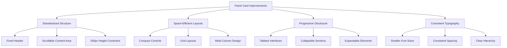

# Panel Card Elements Improvement - Final Summary

## Project Overview

This document provides a final summary of our comprehensive plan to address the panel card element layout issues in the Trillavision Streaming App. We've created detailed implementation plans for all 8 panels that require improvements.

## Identified Issues

After reviewing the codebase and UI, we identified the following common issues across multiple panels:

1. **Content Overflow**: Elements extending beyond the fixed 200px panel height
2. **Inefficient Space Usage**: Poor organization of elements within panels
3. **Inconsistent Layouts**: Varying approaches to element organization
4. **Excessive Scrolling**: Too much vertical content requiring scrolling

## Solution Approach

Our solution focuses on a consistent approach across all panels:



## Standard Panel Structure

All panels will follow this consistent structure:

```jsx
<div className="flex flex-col h-full max-h-[200px] overflow-hidden">
  {/* Panel Header - Always visible */}
  <h2 className="text-base font-semibold mb-1.5">[Panel Title]</h2>
  
  {/* Optional Tabs or Controls - Always visible */}
  <div className="flex mb-1 text-[11px] border-b border-gray-200">
    {/* Tab buttons or quick controls */}
  </div>
  
  {/* Content Area - Scrollable */}
  <div className="flex-1 overflow-y-auto custom-scrollbar">
    {/* Panel content */}
  </div>
</div>
```

## Detailed Implementation Plans

We've created detailed implementation plans for all 8 panels that require improvements:

1. **[Scene Transitions Panel](scene-transitions-panel-improvements.md)**
   - Organize transitions in a compact grid layout
   - Use smaller buttons with icons and minimal text
   - Add a simple duration control that's always visible
   - Use a tabbed interface for settings

2. **[Brand Settings Panel](brand-settings-panel-improvements.md)**
   - Use tabs to separate different brand settings categories
   - Make the color selection more compact with swatches
   - Use a grid layout for color options
   - Implement collapsible sections for less frequently used settings

3. **[Analytics Panel](analytics-panel-improvements.md)**
   - Keep the current centered placeholder message when no data is available
   - Use a tabbed interface to separate different metrics when data is available
   - Use mini charts and compact metric cards
   - Implement a scrollable area for detailed metrics

4. **[Stream Controls Panel](stream-controls-panel-improvements.md)**
   - Keep the warning message and Connect button in a compact format
   - Make the Go Live button more prominent but space-efficient
   - Add status indicators in a horizontal row
   - Use icons with minimal text for additional controls

5. **[Input Devices Panel](input-devices-panel-improvements.md)**
   - Use tabs to separate device types (Camera, Microphone, Screen)
   - Make dropdown selectors more compact
   - Add a scrollable area for when multiple devices are available
   - Use icons to represent device types

6. **[Stream Settings Panel](stream-settings-panel-improvements.md)**
   - Keep the tab navigation at the top
   - Organize settings in logical groups
   - Use dropdown menus and toggles to save space
   - Implement a scrollable area for additional settings

7. **[Overlay Templates Panel](overlay-templates-panel-improvements.md)**
   - Implement a vertical scrollbar for the templates section
   - Organize templates in a grid with smaller thumbnails
   - Add category tabs at the top
   - Include a compact search/filter option

8. **[Recording Panel](recording-panel-improvements.md)**
   - Organize settings in logical groups
   - Use dropdown menus for format and resolution options
   - Implement toggle switches for video/audio options
   - Add a compact recording history section with scroll capability

## Key Design Principles

All panel improvements follow these key design principles:

1. **Fixed Height Constraint**: All panels maintain a 200px height
2. **Efficient Space Usage**: Compact controls and multi-column layouts
3. **Progressive Disclosure**: Tabs and collapsible sections for organization
4. **Consistent Typography**: Smaller font sizes (9-11px) for content
5. **Proper Overflow Handling**: Scrolling only within the content area

## Common UI Patterns

We've identified and applied several common UI patterns across all panels:

1. **Tabbed Interfaces**: Used in 7/8 panels to separate different functionality
2. **Grid Layouts**: Used for organizing related elements efficiently
3. **Compact Form Controls**: Smaller input fields, dropdowns, and buttons
4. **Status Indicators**: Compact pills and icons for showing status
5. **Scrollable Content Areas**: Properly contained within the panel height

## CSS Considerations

The following CSS techniques are used consistently across all panels:

1. `max-h-[200px]` to enforce the height constraint
2. `overflow-y-auto` with `custom-scrollbar` for scrollable areas
3. Smaller text sizes: `text-[9px]`, `text-[10px]`, and `text-[11px]`
4. Reduced form control heights: `h-6` or `h-7`
5. `grid` layouts with appropriate column counts

## Implementation Strategy

The implementation will follow a phased approach:

### Phase 1: Component Framework (1-2 days)
- Create standardized panel components
- Develop reusable UI elements
- Establish consistent styling

### Phase 2: Panel-Specific Implementation (1 week)
- Implement improvements for each panel
- Follow detailed specifications in the documentation
- Maintain all functionality while improving layout

### Phase 3: Testing and Refinement (2-3 days)
- Test at different viewport sizes
- Verify no main UI scrolling is required
- Ensure all functionality remains accessible

## Benefits of Implementation

1. **Improved User Experience**: All controls visible without scrolling the main UI
2. **Better Organization**: Logical grouping of related elements
3. **Consistent Design**: Uniform approach across all panels
4. **Maintained Functionality**: All features remain accessible
5. **Scalable Solution**: Framework can be applied to future panels

## Next Steps

1. Switch to Code mode to begin implementation
2. Start with the component framework
3. Implement each panel according to its detailed plan
4. Test thoroughly after each implementation
5. Refine and optimize as needed

This comprehensive plan provides a clear path forward for addressing the panel card element issues in the Trillavision Streaming App, ensuring a consistent and efficient user interface.