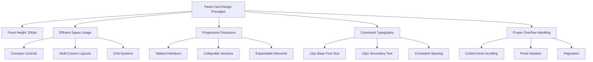

# Panel Card Elements Implementation Plan

## Overview

This document outlines a comprehensive plan for addressing the layout issues in the panel card elements of the Trillavision Streaming App. The goal is to ensure all panels maintain a fixed height of 200px while efficiently organizing their content to avoid overflow and provide a better user experience.

## Current Issues

Based on our analysis, several panels have layout issues:

1. **Content Overflow**: Elements extend beyond the panel boundaries
2. **Inefficient Space Usage**: Poor organization of elements within panels
3. **Inconsistent Layouts**: Varying approaches to element organization
4. **Excessive Scrolling**: Too much vertical content requiring scrolling

## Panels Requiring Fixes

The following panels need layout improvements:

1. ✅ Scene Transitions Panel (detailed in scene-transitions-panel-improvements.md)
2. ✅ Brand Settings Panel (detailed in brand-settings-panel-improvements.md)
3. Stream Controls Panel
4. Device Settings Panel
5. Stream Settings Panel
6. Analytics Panel
7. Overlay Templates Panel
8. Recording Panel

## Common Design Principles

All panel improvements will follow these key design principles:



### 1. Fixed Height Constraint
- All panels must maintain a fixed height of 200px
- Use `max-h-[200px]` to enforce this constraint
- Ensure no content extends beyond this boundary

### 2. Efficient Space Usage
- Use compact controls and multi-column layouts
- Implement grid systems for organizing related elements
- Minimize whitespace while maintaining readability

### 3. Progressive Disclosure
- Use tabs to separate different categories of functionality
- Implement collapsible sections for less frequently used options
- Use expandable elements for detailed settings

### 4. Consistent Typography
- Use smaller font sizes (10-11px) for content
- Maintain hierarchy with font weights
- Ensure text remains legible

### 5. Proper Overflow Handling
- Implement scrolling only within the content area
- Use custom scrollbars for better aesthetics
- Ensure important controls remain visible

## Standard Panel Structure

All panels should follow this basic structure:

```jsx
<div className="flex flex-col h-full max-h-[200px] overflow-hidden">
  {/* Panel Header - Always visible */}
  <h2 className="text-base font-semibold mb-1.5">[Panel Title]</h2>
  
  {/* Optional Tabs or Controls - Always visible */}
  <div className="flex mb-1 text-[11px] border-b border-gray-200">
    {/* Tab buttons or quick controls */}
  </div>
  
  {/* Content Area - Scrollable */}
  <div className="flex-1 overflow-y-auto custom-scrollbar">
    {/* Panel content */}
  </div>
</div>
```

## Implementation Approach

### Phase 1: Component Framework (1-2 days)
1. Create standardized panel components
   - Header component with consistent styling
   - Content area with proper overflow handling
   - Tab system for organizing content
2. Develop reusable UI elements
   - Compact button groups
   - Mini charts and visualizations
   - Collapsible sections
   - Tabbed interfaces for panels

### Phase 2: Panel-Specific Implementation (1 week)
Implement improvements for each panel, following the detailed specifications:

#### 1. Stream Controls Panel (1 day)
- Organize controls into compact groups
- Use icon buttons with tooltips instead of text buttons where appropriate
- Implement a more compact status display

#### 2. Device Settings Panel (1 day)
- Implement collapsible device categories
- Use a scrollable device list with fixed header
- Add search/filter functionality for quick device selection

#### 3. Stream Settings Panel (1 day)
- Group settings into collapsible sections
- Use dropdown selectors for options
- Implement a "Quick Settings" view with advanced options in sub-panels

#### 4. Analytics Panel (1 day)
- Use mini charts with expand option
- Display key metrics as compact cards
- Add a "View Full Analytics" button for detailed view in a modal

#### 5. Overlay Templates Panel (1 day)
- Use a grid of small thumbnails
- Implement hover preview
- Add a "View Details" option for each template

#### 6. Recording Panel (1 day)
- Create a compact recording control section
- Use status indicators instead of verbose text
- Implement collapsible recording history

### Phase 3: Testing and Refinement (2-3 days)
1. Test at different viewport sizes
2. Verify no main UI scrolling is required
3. Ensure all functionality remains accessible
4. Optimize performance for complex panels
5. Address any issues or inconsistencies

## Technical Implementation Details

### CSS Considerations
- Use CSS Grid and Flexbox for efficient space utilization
- Implement proper overflow handling with `overflow-y-auto`
- Use CSS custom properties for consistent dimensions
- Implement a spacing scale for consistency

### React Component Structure
- Create higher-order components for panel patterns
- Use React.memo for performance optimization
- Implement virtualization for long lists
- Use context for panel-specific state management

### Performance Optimization
- Lazy load panel content
- Implement proper memoization
- Optimize re-renders
- Use efficient rendering techniques for charts and visualizations

## Detailed Panel Specifications

### 1. Stream Controls Panel

**Key Issues:**
- Too many controls to fit in standard panel size
- Status indicators take up too much space

**Solution:**
```jsx
<div className="flex flex-col h-full max-h-[200px] overflow-hidden">
  <h2 className="text-base font-semibold mb-1.5">Stream Controls</h2>
  
  {/* Compact status indicators */}
  <div className="flex flex-wrap gap-1 mb-1">
    {/* Status pills with icons */}
  </div>
  
  {/* Main controls in compact layout */}
  <div className="flex-1 overflow-y-auto custom-scrollbar">
    {/* Go Live / End Stream button */}
    {/* Compact view link */}
    {/* Mode indicators */}
  </div>
</div>
```

### 2. Device Settings Panel

**Key Issues:**
- Device lists can be lengthy
- Selection controls take up too much vertical space

**Solution:**
```jsx
<div className="flex flex-col h-full max-h-[200px] overflow-hidden">
  <h2 className="text-base font-semibold mb-1.5">Input Devices</h2>
  
  {/* Device type tabs */}
  <div className="flex mb-1 text-[11px] border-b border-gray-200">
    <button className="px-2 py-1 border-b-2 border-primary">Camera</button>
    <button className="px-2 py-1">Microphone</button>
    <button className="px-2 py-1">Screen</button>
  </div>
  
  {/* Scrollable device list */}
  <div className="flex-1 overflow-y-auto custom-scrollbar">
    {/* Device items */}
  </div>
</div>
```

### 3. Stream Settings Panel

**Key Issues:**
- Complex settings that don't fit in panel
- Multiple categories of settings

**Solution:**
```jsx
<div className="flex flex-col h-full max-h-[200px] overflow-hidden">
  <h2 className="text-base font-semibold mb-1.5">Stream Settings</h2>
  
  {/* Setting category tabs */}
  <div className="flex mb-1 text-[11px] border-b border-gray-200">
    <button className="px-2 py-1 border-b-2 border-primary">General</button>
    <button className="px-2 py-1">Quality</button>
    <button className="px-2 py-1">Advanced</button>
  </div>
  
  {/* Scrollable settings area */}
  <div className="flex-1 overflow-y-auto custom-scrollbar">
    {/* Settings form */}
  </div>
</div>
```

### 4. Analytics Panel

**Key Issues:**
- Charts and data visualizations need space
- Multiple metrics to display

**Solution:**
```jsx
<div className="flex flex-col h-full max-h-[200px] overflow-hidden">
  <h2 className="text-base font-semibold mb-1.5">Analytics</h2>
  
  {/* Metric category tabs */}
  <div className="flex mb-1 text-[11px] border-b border-gray-200">
    <button className="px-2 py-1 border-b-2 border-primary">Overview</button>
    <button className="px-2 py-1">Viewers</button>
    <button className="px-2 py-1">Engagement</button>
  </div>
  
  {/* Key metrics in compact cards */}
  <div className="grid grid-cols-2 gap-1 mb-1">
    {/* Metric cards */}
  </div>
  
  {/* Mini chart */}
  <div className="flex-1 min-h-0">
    {/* Compact chart */}
  </div>
</div>
```

### 5. Overlay Templates Panel

**Key Issues:**
- Template previews need space
- Multiple templates to display

**Solution:**
```jsx
<div className="flex flex-col h-full max-h-[200px] overflow-hidden">
  <h2 className="text-base font-semibold mb-1.5">Overlay Templates</h2>
  
  {/* Template category tabs */}
  <div className="flex mb-1 text-[11px] border-b border-gray-200">
    <button className="px-2 py-1 border-b-2 border-primary">All</button>
    <button className="px-2 py-1">Text</button>
    <button className="px-2 py-1">Social</button>
    <button className="px-2 py-1">Alerts</button>
  </div>
  
  {/* Template grid */}
  <div className="flex-1 overflow-y-auto custom-scrollbar">
    <div className="grid grid-cols-3 gap-1">
      {/* Template thumbnails */}
    </div>
  </div>
</div>
```

### 6. Recording Panel

**Key Issues:**
- Recording controls and status need organization
- Recording history can be lengthy

**Solution:**
```jsx
<div className="flex flex-col h-full max-h-[200px] overflow-hidden">
  <h2 className="text-base font-semibold mb-1.5">Recording</h2>
  
  {/* Recording controls */}
  <div className="flex items-center mb-1">
    {/* Record button */}
    {/* Status indicator */}
    {/* Timer */}
  </div>
  
  {/* Recording settings */}
  <div className="mb-1 p-1 bg-gray-50 rounded text-[11px] flex items-center">
    {/* Format selector */}
    {/* Quality selector */}
  </div>
  
  {/* Recording history */}
  <div className="flex-1 overflow-y-auto custom-scrollbar">
    {/* Recording history items */}
  </div>
</div>
```

## Success Criteria

A successful implementation will:

1. **Maintain Fixed Height**: All panels stay within 200px height
2. **Eliminate Overflow**: No content extends beyond panel boundaries
3. **Preserve Functionality**: All features remain accessible
4. **Improve Usability**: Better organization of elements
5. **Consistent Design**: Uniform approach across all panels
6. **No Main UI Scrolling**: Everything visible in one viewport

## Timeline

| Phase | Task | Duration |
|-------|------|----------|
| 1 | Component Framework | 1-2 days |
| 2 | Scene Transitions Panel | 1 day |
| 2 | Brand Settings Panel | 1 day |
| 2 | Stream Controls Panel | 1 day |
| 2 | Device Settings Panel | 1 day |
| 2 | Stream Settings Panel | 1 day |
| 2 | Analytics Panel | 1 day |
| 2 | Overlay Templates Panel | 1 day |
| 2 | Recording Panel | 1 day |
| 3 | Testing and Refinement | 2-3 days |

Total estimated time: 10-12 days

## Next Steps

1. Review and approve the detailed panel improvement plans
2. Implement the component framework
3. Begin panel-specific implementations, starting with Scene Transitions
4. Test each panel after implementation
5. Refine and optimize as needed
6. Deploy the improved panels

This plan provides a comprehensive approach to addressing the panel card element issues while maintaining all functionality and improving the user experience.