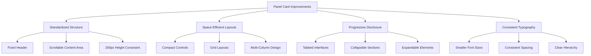

# Panel Card Elements Improvement Summary

## Project Overview

The Trillavision Streaming App requires improvements to its panel card elements to ensure proper layout and organization within the fixed panel dimensions. This document summarizes our analysis and proposed solutions.

## Key Issues Identified

After reviewing the codebase and UI, we identified the following issues:

1. **Layout Problems**: Several panels have elements that extend beyond their boundaries
2. **Inefficient Space Usage**: Poor organization of elements within the fixed 200px height
3. **Inconsistent Designs**: Varying approaches to element organization across panels
4. **Content Overflow**: Too much content for the available space

## Solution Approach

Our solution focuses on reorganizing the panel content while maintaining all functionality:



## Documentation Created

We've prepared the following documents to guide the implementation:

1. **[panel-card-elements-plan.md](panel-card-elements-plan.md)**: Initial analysis and high-level plan
2. **[scene-transitions-panel-improvements.md](scene-transitions-panel-improvements.md)**: Detailed improvements for the Scene Transitions panel
3. **[brand-settings-panel-improvements.md](brand-settings-panel-improvements.md)**: Detailed improvements for the Brand Settings panel
4. **[panel-card-elements-implementation-plan.md](panel-card-elements-implementation-plan.md)**: Comprehensive implementation plan for all panels

## Key Design Principles

All panel improvements will follow these design principles:

1. **Fixed Height Constraint**: All panels maintain a 200px height
2. **Efficient Space Usage**: Compact controls and multi-column layouts
3. **Progressive Disclosure**: Tabs and collapsible sections for organization
4. **Consistent Typography**: Smaller font sizes (10-11px) for content
5. **Proper Overflow Handling**: Scrolling only within the content area

## Standard Panel Structure

```jsx
<div className="flex flex-col h-full max-h-[200px] overflow-hidden">
  {/* Panel Header - Always visible */}
  <h2 className="text-base font-semibold mb-1.5">[Panel Title]</h2>
  
  {/* Optional Tabs or Controls - Always visible */}
  <div className="flex mb-1 text-[11px] border-b border-gray-200">
    {/* Tab buttons or quick controls */}
  </div>
  
  {/* Content Area - Scrollable */}
  <div className="flex-1 overflow-y-auto custom-scrollbar">
    {/* Panel content */}
  </div>
</div>
```

## Implementation Strategy

The implementation will follow a phased approach:

### Phase 1: Component Framework (1-2 days)
- Create standardized panel components
- Develop reusable UI elements
- Establish consistent styling

### Phase 2: Panel-Specific Implementation (1 week)
- Implement improvements for each panel
- Follow detailed specifications in the documentation
- Maintain all functionality while improving layout

### Phase 3: Testing and Refinement (2-3 days)
- Test at different viewport sizes
- Verify no main UI scrolling is required
- Ensure all functionality remains accessible

## Panels Requiring Fixes

The following panels need layout improvements:

1. ✅ Scene Transitions Panel (detailed plan created)
2. ✅ Brand Settings Panel (detailed plan created)
3. Stream Controls Panel
4. Device Settings Panel
5. Stream Settings Panel
6. Analytics Panel
7. Overlay Templates Panel
8. Recording Panel

## Common Techniques Used

1. **Tabbed Interfaces**: Separate content into logical categories
2. **Compact Controls**: Smaller form elements and buttons
3. **Grid Layouts**: Efficient organization of related elements
4. **Collapsible Sections**: Hide less frequently used options
5. **Thumbnail Previews**: Replace full-size previews with smaller versions

## Benefits of Implementation

1. **Improved User Experience**: All controls visible without scrolling the main UI
2. **Better Organization**: Logical grouping of related elements
3. **Consistent Design**: Uniform approach across all panels
4. **Maintained Functionality**: All features remain accessible
5. **Scalable Solution**: Framework can be applied to future panels

## Next Steps

1. Review and approve the detailed panel improvement plans
2. Implement the component framework
3. Begin panel-specific implementations, starting with Scene Transitions
4. Test each panel after implementation
5. Refine and optimize as needed

## Timeline

Total estimated implementation time: 10-12 days

| Phase | Task | Duration |
|-------|------|----------|
| 1 | Component Framework | 1-2 days |
| 2 | Panel Implementations | 7 days |
| 3 | Testing and Refinement | 2-3 days |

This summary provides an overview of our approach to addressing the panel card element issues in the Trillavision Streaming App. The detailed implementation plans provide specific guidance for each panel.